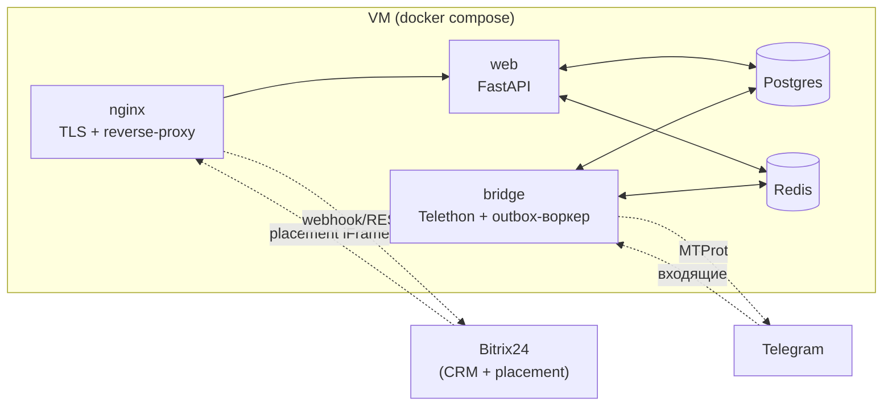

# Bitrix-TG

**Замена сервиса Wazzup:** интеграция личных аккаунтов Telegram (MTProto) с облачной CRM Bitrix24. Менеджеры ведут переписку с клиентами прямо из карточки сделки, не покидая Bitrix24.

Промышленное решение с собственной БД (вся история переписки, чего не делает Wazzup), защитой от бана Telegram и мультиаккаунтностью — у каждого менеджера своя TG-симка, своя сессия.

## Возможности

- 📩 **Виджет в карточке сделки Bitrix24** — вкладка «Telegram-чат» через Placement (iFrame). Менеджер видит историю и пишет ответы не выходя из CRM.
- 👤 **Личные TG-аккаунты** (не бот) — MTProto/Telethon, может писать первым. Один менеджер = одна симка = одна сессия.
- 🔁 **Двусторонняя синхронизация с CRM** — входящее сообщение → авто-матчинг по номеру → создание Контакта/Сделки → запись в timeline → уведомление менеджеру.
- 🛡️ **Защита от бана (4 слоя)** — раздельные throttle для ответов/инициаций, outbox-очередь с retry+backoff, обработка FloodWait, health-чек сессий.
- 💾 **Полное хранение переписки** — своя Postgres + дублирование в timeline Bitrix24.
- 🧩 **Расширяемо под другие мессенджеры** — абстракция `MessengerProvider`, готова точка расширения под MAX.

## Стек

| Слой | Технологии |
|---|---|
| Язык | Python 3.11 |
| Web | FastAPI, Uvicorn, Vanilla JS + Alpine.js (без сборщика) |
| БД | PostgreSQL 16, SQLAlchemy 2.0 async, Alembic |
| Очередь | Outbox-паттерн (Postgres) + Redis (готов под WebSocket pub/sub) |
| Telegram | Telethon (MTProto user-API) |
| Инфра | Docker Compose, nginx, Let's Encrypt |
| Качество | pytest + pytest-asyncio (86 тестов), ruff, TDD |

## Архитектура

Два процесса в одном Docker-образе (разделение для изоляции сбоев):



- **web** — FastAPI: виджет placement, REST API (диалоги, сообщения, шаблоны), webhook B24.
- **bridge** — пул Telethon-сессий: ловит входящие → синхронизирует с CRM → пишет в БД; крутит outbox-воркер для исходящих.
- Общаются через Postgres (outbox-таблица) + Redis (готов под real-time).

### Поток входящего сообщения
```
Telegram → bridge (Telethon event) → IncomingHandler
  → Bitrix24Sync: findbyComm → создать Контакт/Сделку → timeline → notify менеджеру
  → persist в Postgres (Contact/Dialog/Message, идемпотентно по tg_message_id)
  → менеджер видит в виджете (poll каждые 3 сек)
```

### Поток исходящего сообщения
```
Менеджер пишет в виджете → POST /api/dialogs/{id}/messages
  → создаёт Message(out, pending) + OutboxItem(queued) [одна транзакция]
  → OutboxWorker: throttle-проверка → TelegramProvider.send_message → FloodWait/retry
  → Telethon отправляет → статус доставки
```

## Структура проекта

```
src/app/
├── b24/                  # Интеграция Bitrix24
│   ├── client.py         #   async REST-клиент (httpx)
│   ├── token_manager.py  #   OAuth-токены + авто-refresh
│   ├── crm.py            #   CRM-операции (контакт, сделка, timeline)
│   ├── im.py             #   уведомления менеджеру + event.bind
│   └── sync.py           #   оркестрация: матчинг → создание → timeline
├── bridge/               # Фоновая обработка
│   ├── session_manager.py    # пул Telethon-сессий (по одной на аккаунт)
│   ├── throttler.py          # анти-бан: 2 политики (ответы/инициации)
│   ├── outbox_worker.py      # очередь отправки (6 путей: success/flood/throttle/...)
│   ├── outbox_repo_*.py      # репозиторий outbox (SQLAlchemy + воркер-adapter)
│   ├── incoming_handler.py   # связка: TG-сообщение → CRM + БД
│   ├── bootstrap.py          # запуск: загрузка аккаунтов, подписки, воркер
│   └── health_checker.py     # мониторинг сессий
├── messaging/            # Абстракция мессенджеров
│   ├── provider.py       #   MessengerProvider (точка расширения под MAX)
│   ├── types.py          #   IncomingMessage, SendResult, DeliveryStatus
│   └── telegram/         #   реализация на Telethon
├── models/               # ORM (10 таблиц)
├── web/                  # FastAPI
│   ├── routes/           #   health, webhook, placement, dialogs, templates
│   ├── session.py        #   HMAC-сессионная кука
│   ├── deps.py           #   get_current_manager
│   └── app.py            #   factory + CORS + StaticFiles + exception handler
├── static/               # Фронтенд (Vanilla JS + Alpine.js)
└── main.py               # entrypoint: web | bridge | auth
```

## Разработка

```bash
git clone https://github.com/Godila/B24-TG.git
cd B24-TG
python -m venv .venv && source .venv/bin/activate   # Windows: .venv\Scripts\activate
pip install -e ".[dev]"

# тесты + линт
pytest -v          # 86 тестов
ruff check src/ tests/
```

Переменные окружения — см. `.env.example`. Для локальной разработки можно работать без реального Telegram (моки httpx) и без B24 (dev-режим).

## Развёртывание

Production-деплой описан в [`docs/DEPLOY.md`](docs/DEPLOY.md). Кратко:

1. VM с публичным IP + домен с A-записью.
2. Локальное OAuth-приложение в Bitrix24 (scopes: `crm`, `im`, `placement`, `user`).
3. `git clone` на VM, сгенерировать `.env` (`scripts/gen_prod_env.py` — случайные секреты).
4. `docker compose up -d --build` + `alembic upgrade head`.
5. Let's Encrypt TLS + `placement.bind` (скрипт `scripts/register_placement.py`).
6. Подключить реальный TG-аккаунт (см. ниже).

### Подключение Telegram-аккаунта (для реальной отправки/приёма)

```bash
# 1. Получить api_id/api_hash на https://my.telegram.org → в .env
# 2. Первый вход (номер → SMS-код → 2FA)
docker compose exec web python -m app.main auth
# 3. Активировать аккаунт в БД
docker compose exec postgres psql -U bitrix_tg -d bitrix_tg -c \
  "UPDATE tg_accounts SET status='active', phone='<номер>' WHERE id=1;"
# 4. Перезапустить bridge — подхватит аккаунт
docker compose restart bridge
```

В логах bridge должно появиться: `Registered session for account_id=1`.

## Безопасность

- **Auth виджета**: B24 передаёт `user_id` + `access_token` → проверка токена через `user.current` → HMAC-подписанная сессионная кука (httponly, SameSite=Lax). Никаких паролей в UI.
- **Публичные порты**: только nginx (80/443). Postgres/Redis — внутри docker-сети.
- **Секреты**: генерируются случайно на VM (`SESSION_SECRET`, `POSTGRES_PASSWORD`, `B24_WEBHOOK_SECRET`), хранятся в `.env` (chmod 600, в `.gitignore`).
- **Идемпотентность**: дубли сообщений (MTProto redelivery) отсеиваются по `(dialog_id, tg_message_id)`.

## Статус

| Фаза | Содержание | Статус |
|---|---|---|
| 1 | Фундамент (модели, провайдеры, outbox, throttler) | ✅ |
| 2 | Bitrix24Sync (OAuth, CRM, timeline, вебхуки) | ✅ |
| 3 | Web UI + placement-виджет | ✅ |
| 4 | Деплой (nginx, TLS, placement.bind) | ✅ |
| 5 | Активация bridge-конвейера | ✅ |

Вся инфраструктура готова и работает в production. Для end-to-end обмена сообщениями остаётся подключить реальный Telegram-аккаунт (см. раздел выше).

## Лицензия

Внутренний проект. Все права защищены.
