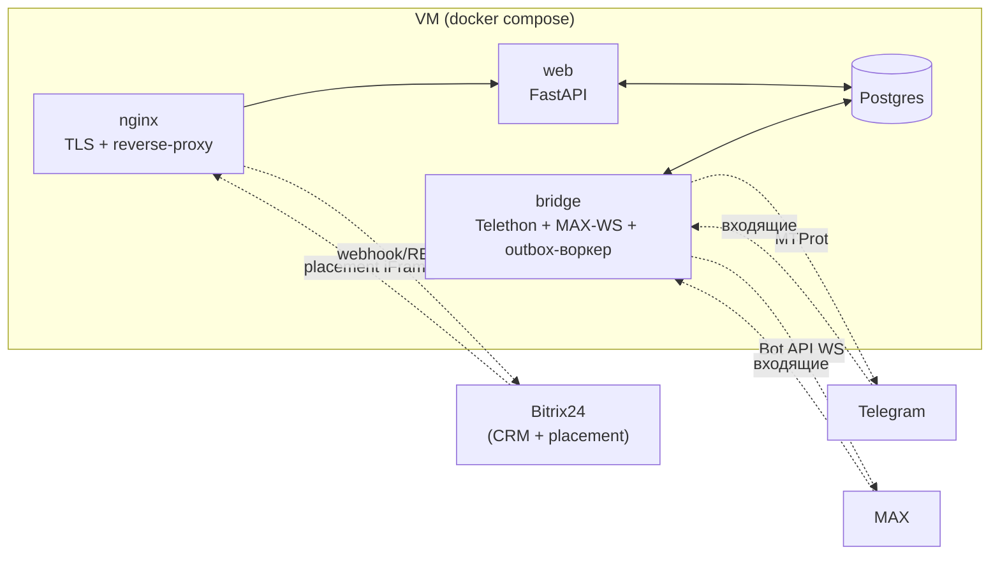

<p align="center"></p>

# ЧатМост

**Мост между мессенджерами и Bitrix24** — замена сервиса Wazzup на собственных мощах. Личные аккаунты Telegram и MAX подключаются к облачной CRM: менеджеры ведут переписку с клиентами прямо из Битрикс24, не покидая карточку сделки.

Вся история переписки — в собственной PostgreSQL (чего не делает Wazzup), мультиаккаунтность (у каждого менеджера своя сессия), защита от бана, два канала — Telegram и MAX.

> Работает в production: [b24-tg.haragy.top](https://b24-tg.haragy.top) · TG + MAX активны · 435 тестов green.

## Возможности

- 💬 **«Чаты» — общий мессенджер** — пункт левого меню Битрикс24: все диалоги менеджера в одном окне (как в Wazzup). Неотвеченные сверху с возрастом ожидания, счётчик в заголовке вкладки, звук на новый входящий, пагинация списка.
- 📩 **Виджет в карточке сделки** — вкладка чата через Placement (iFrame): история и ответы не выходя из CRM.
- 👥 **Личные аккаунты, не боты** — Telegram (MTProto/Telethon, можно писать первым) и MAX (официальный Bot API, WebSocket). Один менеджер = свой аккаунт в каждом канале; подключение по QR прямо из панели.
- 🔁 **Двусторонняя синхронизация с CRM** — входящее → матчинг по номеру → Контакт/Сделка (создание или дедуп) → комментарий в timeline → уведомление менеджеру.
- 🛡️ **Защита от бана (4 слоя)** — раздельные throttle для ответов/инициаций, outbox-очередь с retry+backoff, обработка FloodWait, health-чек сессий с самолечением.
- 🔧 **Панель управления** — в том же пункте меню: менеджеры и роли (supervisor видит все диалоги), подключение каналов по QR, шаблоны ответов, режим read-only.
- 💾 **Вся история у вас** — PostgreSQL + дублирование в timeline Битрикс24; ежедневные автобэкапы (pg_dump + сессии, ротация 7 дней).

## Стек

| Слой | Технологии |
|---|---|
| Язык | Python 3.11 |
| Web | FastAPI, Uvicorn, Vanilla JS + Alpine.js (без сборщика) |
| БД | PostgreSQL 16, SQLAlchemy 2.0 async, Alembic |
| Очереди | Outbox + crm_sync (обе в Postgres) |
| Telegram | Telethon (MTProto user-API) |
| MAX | Bot API (WebSocket, bot token) |
| Инфра | Docker Compose, nginx (TLS, gzip, кэш статики), Let's Encrypt |
| Качество | pytest + pytest-asyncio (435 тестов), ruff |

## Архитектура

Два процесса в одном Docker-образе (разделение для изоляции сбоев):



- **web** — FastAPI: placement-обработчики (оболочка «Чаты/Панель», виджет сделки), REST API (диалоги, сообщения, шаблоны), webhook B24, статика.
- **bridge** — пул сессий мессенджеров: входящие → синхронизация с CRM → БД; outbox-воркер для исходящих; health-чек с самолечением.
- Общаются через Postgres (outbox- и crm_sync-таблицы) — компоненты заменяемы независимо.

### Поток входящего сообщения
```
Telegram/MAX → bridge (event) → IncomingHandler
  → Bitrix24Sync: findbyComm → создать Контакт/Сделку → timeline → notify менеджеру
  → persist в Postgres (Contact/Dialog/Message, идемпотентно по external_message_id)
  → менеджер видит в «Чатах»/виджете (poll 3 сек)
```

### Поток исходящего сообщения
```
Менеджер пишет → POST /api/dialogs/{id}/messages
  → Message(out, pending) + OutboxItem(queued) в одной транзакции
  → OutboxWorker: throttle → провайдер канала → FloodWait/retry/backoff
  → статусы доставки (⏳ → ✓ → ✓✓) в UI
```

## Структура проекта

```
src/app/
├── b24/                  # Интеграция Bitrix24 (REST-клиент, OAuth, CRM, timeline, sync)
├── bridge/               # Фоновая обработка (сессии, throttler, outbox, incoming, health)
├── messaging/            # Абстракция MessengerProvider + telegram/ (MTProto) и max/ (Bot API)
├── media/                # Хранилище вложений: общий том web+bridge, uuid-имена, MIME-правила
├── models/               # ORM
├── web/                  # FastAPI (routes, сессии, deps, exception-страницы)
├── static/               # Фронтенд (Alpine.js, бренд-ассеты в static/brand/)
└── main.py               # entrypoint: web | bridge | auth
assets/logo/              # Исходники логотипа (мастер + все размеры/негативы)
docs/DESIGN.md            # Дизайн-система (линза, токены, компоненты, реестр UX)
docs/DEPLOY.md            # Production-деплой
```

## Разработка

```bash
git clone https://github.com/Godila/ChatMost.git
cd ChatMost
python -m venv .venv && source .venv/bin/activate   # Windows: .venv\Scripts\activate
pip install -e ".[dev]"

pytest -v          # 435 тестов
ruff check src/ tests/
```

Переменные окружения — см. `.env.example`. Локальная разработка работает без реальных мессенджеров (моки httpx) и без B24 (dev-режим с AUTH-JSON).

## Развёртывание

Production-деплой описан в [`docs/DEPLOY.md`](docs/DEPLOY.md). Кратко:

1. VM с публичным IP + домен с A-записью.
2. Локальное OAuth-приложение в Bitrix24 (scopes: `crm`, `im`, `placement`, `user`).
3. `git clone` на VM, сгенерировать `.env` (`scripts/gen_prod_env.py`).
4. `docker compose up -d --build` + `alembic upgrade head`.
5. Let's Encrypt TLS + `placement.bind` (скрипт `scripts/bind_chats_placement.py`).
6. Подключить аккаунты менеджеров — QR-онбординг из вкладки «Панель».

⚠️ После каждого деплоя `docker compose restart nginx` — иначе держит старый IP пересозданного web-контейнера (502).

## Безопасность

- **Auth**: placement-вызов B24 → проверка AUTH_ID через `user.current` (с TTL-кэшем токена) → HMAC-подписанная сессионная кука (httponly, SameSite=none для iframe). Деактивированный менеджер отрезается на каждом API-запросе.
- **Права**: менеджер видит только свои диалоги; supervisor — все, но пишет только в свои. Чужие диалоги — 404 без раскрытия существования.
- **CSRF**: сверка Origin на всех мутирующих запросах (кука SameSite=none летит и кросс-сайтовым POST).
- **Публичные порты**: только nginx (80/443). Postgres — внутри docker-сети.
- **Секреты**: генерируются на VM, живут в `.env` (chmod 600, в `.gitignore`). 2FA-пароли каналов — только транзит, не хранятся.
- **Идемпотентность**: дубли (MTProto redelivery, MAX reconnect) отсеиваются по `(dialog_id, external_message_id)`.
- **Медиа-вложения** (TG и MAX): общий docker-том (в БД только метаданные), раздача через авторизованный API (владелец диалога/supervisor), inline — лишь безопасные MIME (SVG/HTML исключены), кэш `private`; загрузки ≤25 МБ по allowlist.

## Статус

| Этап | Содержание | Статус |
|---|---|---|
| Фазы 1–5 | Фундамент → CRM-синк → Web UI → деплой → активация bridge | ✅ |
| Прод | b24-tg.haragy.top: TG + MAX активны, e2e в обе стороны | ✅ работает |
| Эксплуатация | Автобэкапы, ротация логов, selfheal сессий, алерты в B24 | ✅ |

## Лицензия

Внутренний проект. Все права защищены.
